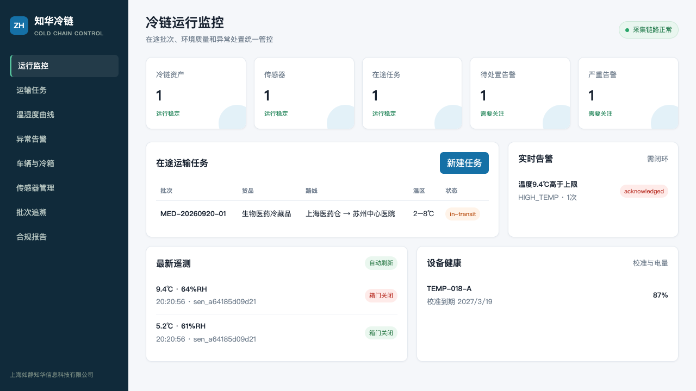
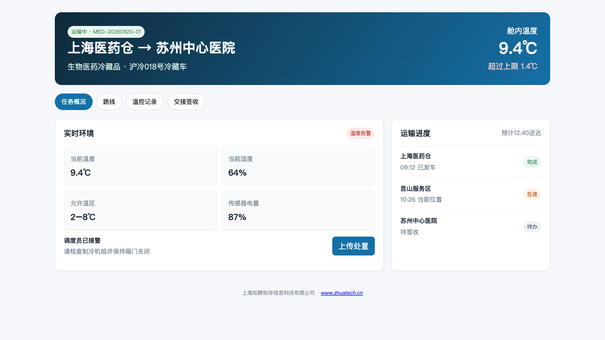

# 知华冷链物联网监控平台

> 让每一批冷藏品都有连续温控记录，让每一次异常都有责任人和处置证据。

`zhuatech-coldchain` 服务于医药、生鲜、食品与第三方冷链物流场景。项目已经实现冷链资产、传感器、运输批次、温湿度遥测、超限告警、路线时间轴、异常处置、电子签收和批次合规报告。

知华科技官网：[https://www.zhuatech.cn/](https://www.zhuatech.cn/)

维护主体：上海如静知华信息科技有限公司。

## 产品界面

| 冷链监控中心 | 司机移动作业端 |
| --- | --- |
|  |  |

## 系统解决什么问题

传统冷链记录往往散落在温度计、纸质单据和司机聊天记录中。本项目把数据组织成一个闭环：

```text
资产与传感器 → 运输任务 → 连续遥测 → 阈值判定 → 告警签收
      → 原因与纠正措施 → 目的地签收 → 批次合规报告
```

未关闭的严重温控告警会阻止运输任务完成签收，避免“异常未处理但流程已结束”。同一传感器、同一批次、同一告警类型在未关闭前自动合并并累计出现次数，减少告警风暴。

## 核心功能矩阵

| 业务域 | 主要功能 |
| --- | --- |
| 冷链资产 | 冷库、冷藏车、保温箱，组织归属与利用状态 |
| 传感器 | 唯一编码、资产绑定、校准期限、电池、在线时间 |
| 运输任务 | 批次、货品、承运方、路线、传感器和温控阈值固化 |
| 实时采集 | 温度、湿度、门磁、定位、事件去重和设备状态更新 |
| 规则告警 | 高低温、湿度、开门，风险分级与重复告警抑制 |
| 异常处置 | 签收、责任人、原因、措施、证据与关闭审计 |
| 运输履约 | 发车、路线节点、到达、签收人和签名凭证 |
| 合规报告 | 采样数量、最高/最低/平均温度、处置率和路线记录 |

## 3分钟启动

```bash
cp .env.example .env
npm test
COLDCHAIN_API_KEY=zhuatech-demo-key npm start
```

- 冷链监控中心：`http://127.0.0.1:18103/`
- 司机端：`http://127.0.0.1:18103/driver`
- Docker：`docker compose up --build`

生产部署建议使用 MQTT/物联网平台承接设备流量，将领域快照替换为 MySQL，并通过消息队列解耦遥测与告警。仓库内的 `database/schema.sql`、[API文档](docs/API.md) 和 [架构说明](docs/ARCHITECTURE.md)提供了改造边界。

## 验证结果

测试覆盖正常遥测去重、温度超限告警、告警签收与关闭、严重告警阻断签收、合规报告生成。所有演示车辆、医院、批次和定位均为虚构数据。

## 许可和商业使用

本社区源码仅限个人非商业学习交流，不得商用。企业内部部署、真实冷链数据处理、项目交付、SaaS、咨询实施和品牌替换均需要知华科技书面授权。商业授权或定制开发请微信添加 `zhuatech` 或 `zhuatech2`。

| 微信号 `zhuatech` | 微信号 `zhuatech2` |
| --- | --- |
|  |  |

本项目属于 source-available 社区源码，并非 OSI 定义的开源许可项目。Copyright © 上海如静知华信息科技有限公司。
